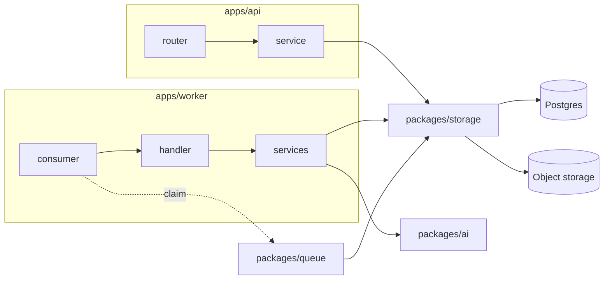

# Backend architecture

Target shape for `apps/api` and `apps/worker`, modelled on the stamina monorepo. Repo layout: [overview.md](./overview.md). Locked tradeoffs: [decisions.md](./decisions.md).

Stamina is NestJS; we are FastAPI. The framework differs, the **layering does not**. This doc fixes the Python spelling of each stamina concept so the two repos stay legible to the same person.

## Concept map

| Stamina (NestJS) | Kosh (FastAPI) | Job |
|---|---|---|
| `library/<name>/` | `packages/<name>/` | Shared, app-agnostic capability |
| `apps/service/src/modules/<f>/` | `apps/api/src/api/modules/<f>/` | One feature, all its layers |
| `<f>.controller.ts` | `<f>/router.py` | HTTP in, HTTP out. No rules. |
| `<f>.service.ts` | `<f>/service.py` | Business rules. No `fastapi` import. |
| DTO classes | `<f>/schemas.py` | Request/response shapes |
| `<f>.module.ts` | `<f>/__init__.py` | Wiring — exports `router` |
| `common/filters/` | `common/exception_handlers.py` | Domain error → HTTP status |
| `common/decorators/` | `common/dependencies.py` | `SessionDep`, guards |
| worker `<x>.controller.ts` | `consumers/<x>/consumer.py` | Queue in, ack/nack out |
| worker `<x>.handler.ts` | `consumers/<x>/handler.py` | Orchestration, returns outcome |
| worker `<d>/*.service.ts` | `consumers/<x>/services/*.py` | One responsibility each |
| `BootstrapPubSubMicroservice` | `packages/queue` runtime | Transport loop, hidden from consumers |

## The one rule

Imports flow one direction. Nothing bends it.

```
router ──▶ service ──▶ packages (storage · security · ai) ──▶ Postgres / S3 / OpenRouter
```

Three corollaries, each of which the current code breaks:

- **A router never imports `storage.crud.*`.** It calls its service. Today `routers/spend.py:8` and `routers/documents.py:10` reach straight into CRUD, which is why there is no place to put a rule that spans two tables.
- **A service never imports `fastapi`.** It raises domain errors; `common/exception_handlers.py` turns them into status codes. That deletes the six-branch `try/except` at `routers/documents.py:91`.
- **A module never imports another module's internals.** Today `routers/documents.py:28` imports the private `_public` out of `routers/spend.py`. Cross-feature reuse moves down into `packages/`, or the caller asks the owning module's service.

## apps/api

```
apps/api/src/api/
  main.py                    app factory, lifespan, CORS — nothing else
  bootstrap.py               register routers + exception handlers
  modules/
    health/  router.py
    auth/    router.py  service.py  schemas.py
    users/   router.py  service.py  schemas.py
    spend/   router.py  service.py  schemas.py  presenter.py
    documents/
      router.py
      schemas.py
      presenter.py
      services/              split when one service.py passes ~200 lines
        upload.py            sniff, hash, idempotency, blob write  (from api/documents.py)
        confirm.py           mode resolution + eligibility          (from router:155-210)
  common/
    dependencies.py          SessionDep, CurrentUserDep, pagination
    errors.py                DomainError base + subclasses
    exception_handlers.py    DomainError → HTTPException
```

`presenter.py` holds the model→schema mapping (`_public`, `_summary`, `_detail`). It is public, so a sibling module may import it; that is the legal version of what `documents.py:28` does today.

Stamina keeps controllers to roughly a screen — parse, delegate, return. `routers/documents.py:155-210` is 55 lines of confirmation policy and is the clearest thing to move first.

## apps/worker

The worker is the bigger gap. `main.py:19-33` fuses the poll loop, the claim, the dispatch and the crash handler into one `while True`; `pipeline.py:32-116` then does blob read, extraction, three distinct failure classifications, attempt recording, draft mapping and status transition in a single 85-line function that re-fetches the claimed row four separate times.

Stamina splits exactly this into transport / orchestration / single-responsibility services. Same split here:

```
apps/worker/src/worker/
  bootstrap.py               load env, init logging, hand to runtime   (stamina bootstrap.ts)
  main.py                    pick consumer, start runtime              (stamina main.ts)
  consumers/
    extraction/
      consumer.py            claim → handler → ack/nack. No rules.
      handler.py             orchestrates services, returns Outcome
      schemas.py             ReceiptExtraction | StatementExtraction
      services/
        loader.py            blob fetch, BlobError → Outcome.failed
        extractor.py         calls packages/ai; classifies retryable
        attempt_writer.py    ExtractionAttempt rows
        draft_mapper.py      extraction → list[SpendItem]  (from pipeline:119)
        validator.py         receipt totals mismatch → warning
  common/
    outcome.py               Outcome: Ready | Retry | Failed(reason)
```

Two things this buys, both of which the current code lacks:

**The handler stops branching on transport.** Every failure path returns an `Outcome` instead of calling `mark_failed` / `mark_retry` inline. One place — the consumer — reads the outcome and writes the status. The four `get_claimed_document` re-fetches collapse to one.

**A second job costs a folder, not a rewrite.** Categorisation, recurring-spend detection and notification each become `consumers/<name>/` with the same five files, sharing `runtime` and `common`. Stamina runs 20+ consumers off this shape; today a second job would mean a second `while True` in `main.py`.

## packages (= stamina `library/`)

Already correct: `storage`, `security`. Add as the need lands, not before:

| Package | Pull from | Why now |
|---|---|---|
| `queue` | `storage/crud/document.py` claim helpers + `worker/main.py` loop | The claim protocol is transport, not document logic. Consumers should receive a job, not poll for one. |
| `ai` | `worker/extract.py` | `apps/agent` (see overview.md) needs the same OpenRouter client. Stamina keeps this in `library/ai`. |
| `logging` | — | Only once a second consumer exists and correlation ids start mattering. |

Rule for promotion: code enters `packages/` when the **second** app needs it, not in anticipation of the first.

## Request and job paths



## Migration order

Each step ships green on its own; none needs the next.

1. `common/dependencies.py` — hoist the `SessionDep` duplicated at `spend.py:21` and `documents.py:38`.
2. `common/errors.py` + handlers — move the upload `try/except` out of the router; `api/documents.py` raises, the handler maps.
3. `modules/spend/` — smallest feature, proves the layout. `_public` becomes `presenter.py`.
4. `modules/documents/` — the payoff: `confirm` policy moves to `services/confirm.py`, and the private cross-import at `documents.py:28` dies.
5. `modules/auth|users|health/` — mechanical once 3 and 4 land.
6. Worker `Outcome` + `consumers/extraction/` — split `pipeline.py` last; it is the one place with no test seam yet beyond `tests/test_extract.py`.

Tests move with their module (`tests/modules/<f>/`), mirroring stamina's per-project `jest.config.ts`.
