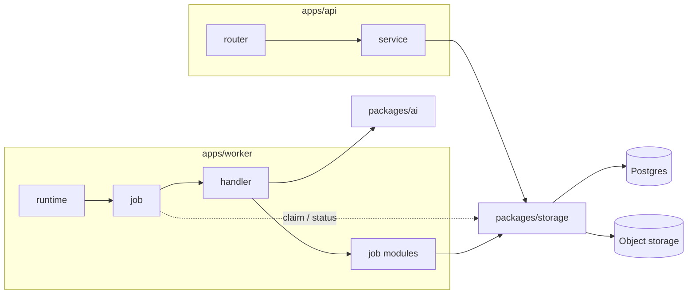

# Backend architecture

Target shape for `apps/api` and `apps/worker`, modelled on the stamina monorepo. Repo layout: [overview.md](./overview.md). Locked tradeoffs: [decisions.md](./decisions.md).

Stamina is NestJS; we are FastAPI. The framework differs, the **layering does not**. This doc fixes the Python spelling of each stamina concept so the two repos stay legible to the same person.

## Concept map

| Stamina (NestJS) | Kosh (FastAPI) | Job |
|---|---|---|
| `library/<name>/` | `packages/<name>/` | Shared, app-agnostic capability |
| `apps/service/src/modules/<f>/` | `apps/api/src/api/modules/<f>/` | One feature, all its layers |
| `<f>.controller.ts` | `<f>/router.py` | HTTP in, HTTP out. No rules. |
| `<f>.service.ts` | `<f>/service.py` | Business rules. No `fastapi` import. |
| DTO classes | `<f>/schemas.py` | Request/response shapes |
| `<f>.module.ts` | `<f>/__init__.py` | Wiring — exports `router` |
| `common/filters/` | `common/exception_handlers.py` | Domain error → HTTP status |
| `common/decorators/` | `common/dependencies.py` | `SessionDep`, guards |
| worker `<x>.controller.ts` | `jobs/<x>/job.py` | Claim in, status out (ack/nack) |
| worker `<x>.handler.ts` | `jobs/<x>/handler.py` | Orchestration, returns `Outcome` |
| worker `<d>/*.service.ts` | `jobs/<x>/<module>.py` | One responsibility each |
| `BootstrapPubSubMicroservice` | `worker/runtime.py` | Poll loop over registered jobs |

## The one rule

Imports flow one direction. Nothing bends it.

```
router ──▶ service ──▶ packages (storage · security · ai) ──▶ Postgres / S3 / OpenRouter
```

Three corollaries, each of which the current code breaks:

- **A router never imports `storage.crud.*`.** It calls its service. Today `routers/spend.py:8` and `routers/documents.py:10` reach straight into CRUD, which is why there is no place to put a rule that spans two tables.
- **A service never imports `fastapi`.** It raises domain errors; `common/exception_handlers.py` turns them into status codes. That deletes the six-branch `try/except` at `routers/documents.py:91`.
- **A module never imports another module's internals.** Today `routers/documents.py:28` imports the private `_public` out of `routers/spend.py`. Cross-feature reuse moves down into `packages/`, or the caller asks the owning module's service.

## apps/api

```
apps/api/src/api/
  main.py                    app factory, lifespan, CORS — nothing else
  bootstrap.py               register routers + exception handlers
  modules/
    health/  router.py
    auth/    router.py  service.py  schemas.py
    users/   router.py  service.py  schemas.py
    spend/   router.py  service.py  schemas.py  presenter.py
    documents/
      router.py
      schemas.py
      presenter.py
      services/              split when one service.py passes ~200 lines
        upload.py            sniff, hash, idempotency, blob write  (from api/documents.py)
        confirm.py           confirm every reviewed draft item
  common/
    dependencies.py          SessionDep, CurrentUserDep
    pagination.py            Page mixin, Paginated[T] envelope
    errors.py                DomainError base + subclasses
    exception_handlers.py    DomainError → HTTPException
```

`presenter.py` holds the model→schema mapping (`_public`, `_summary`, `_detail`). It is public, so a sibling module may import it; that is the legal version of what `documents.py:28` does today.

Stamina keeps controllers to roughly a screen — parse, delegate, return. Document confirmation policy stays in `services/confirm.py` so the router only parses, delegates, and presents.

## apps/worker

One loop, many jobs. The runtime knows nothing about documents; each job owns its claim, its orchestration and its status writes, and calls `packages/*` for data and AI.

```
apps/worker/src/worker/
  main.py                    bootstrap(), then runtime.run(JOBS)       (stamina main.ts)
  bootstrap.py               logging, settings, Postgres ping          (stamina bootstrap.ts)
  settings.py                poll interval
  runtime.py                 Claim(id, token), Job(name, reclaim, claim, run), the loop
  outcome.py                 Outcome: ready | retry | failed
  jobs/
    __init__.py              JOBS: the registry; order = priority
    extraction/
      __init__.py            JOB = Job("extraction", reclaim_stuck, claim, run)
      job.py                 claim(); run(): re-check claim → handler → status write. No rules.
      handler.py             blob → ai.extract → validation → attempt → drafts; returns Outcome
      drafts.py              extraction → SpendItem drafts; save() upserts without committing
      validation.py          receipt totals mismatch → warning
      attempts.py            ExtractionAttempt rows
```

**The runtime** gives one unit of work per round to the first job in `JOBS` that has any, and sleeps only when every job is idle. A crash is logged with the job name and never stops the loop.

**A job** exposes `reclaim(session) -> int`, `claim(session) -> Claim | None` and `run(Claim)`. Claims use `FOR UPDATE SKIP LOCKED` plus a claim token through `storage` crud; `run` re-checks the token before and after the handler, and the status write commits the attempt and drafts in the same transaction.

**The handler never writes a status.** Every failure path returns an `Outcome`; `job.py` alone maps it to `mark_ready` / `mark_retry` / `mark_failed`.

**A second job costs a folder and one line.** Add `jobs/<name>/` with the same shape and append its `JOB` to `JOBS`. Tests mirror it: `apps/worker/tests/<name>/`, plus `test_runtime.py` for the loop.

## packages (= stamina `library/`)

Already correct: `storage`, `security`. Add as the need lands, not before:

| Package | Pull from | Why now |
|---|---|---|
| `queue` | `worker/runtime.py` + the claim helpers in `storage/crud` | Only when a second app needs the same loop, or multiple worker hosts need a real broker. |
| `ai` | `worker/extract.py` | `apps/agent` (see overview.md) needs the same OpenRouter client. Stamina keeps this in `library/ai`. |
| `observability` | — | Api and worker both need one formatter, redaction and bound request/job ids. Not named `logging`: a top-level module of that name shadows the standard library for every importer. |

Rule for promotion: code enters `packages/` when the **second** app needs it, not in anticipation of the first.

## Request and job paths


```mermaid
flowchart LR
  subgraph api[apps/api]
    R[router] --> S[service]
  end
  subgraph wrk[apps/worker]
    RT[runtime] --> J[job] --> H[handler] --> M[job modules]
  end
  S --> P[packages/storage]
  J -.claim / status.-> P
  M --> P
  H --> AI[packages/ai]
  P --> PG[(Postgres)]
  P --> S3[(Object storage)]
```

## Migration order

Each step ships green on its own; none needs the next.

1. `common/dependencies.py` — hoist the `SessionDep` duplicated at `spend.py:21` and `documents.py:38`.
2. `common/errors.py` + handlers — move the upload `try/except` out of the router; `api/documents.py` raises, the handler maps.
3. `modules/spend/` — smallest feature, proves the layout. `_public` becomes `presenter.py`.
4. `modules/documents/` — the payoff: `confirm` policy moves to `services/confirm.py`, and the private cross-import at `documents.py:28` dies.
5. `modules/auth|users|health/` — mechanical once 3 and 4 land.
6. Worker `Outcome` + `jobs/extraction/` — split `pipeline.py` last; it is the one place with no test seam yet beyond `tests/test_extract.py`.

Tests move with their module (`tests/modules/<f>/`), mirroring stamina's per-project `jest.config.ts`.
