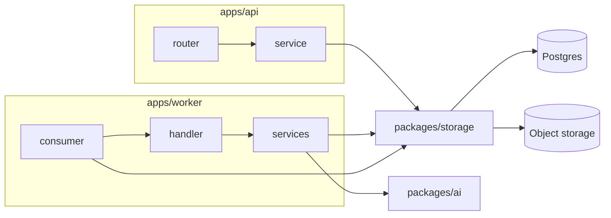

# Align the app to backend.md layering

Execution plan for the target in [backend.md](./backend.md). Current paths: [overview.md](./overview.md). Tradeoffs: [decisions.md](./decisions.md).

`apps/web` already matches [design/README.md](../design/README.md) and `.cursor/rules/frontend.mdc`. The gap is the API (flat `routers/` with CRUD in the router) and the worker (one `pipeline.py`).

HTTP paths, status codes and JSON shapes do not change. Services stay functions — decision #33, no controller or repository classes.



No `packages/queue`. `main.py` keeps the poll/claim loop; `consumer.py` is claim-result → handler → ack/nack.

## Audit corrections to the draft

Verified against the tree. Nine changes; the first two are the ones that would have broken a phase.

| # | Draft said | Actually | Effect |
|---|---|---|---|
| 1 | "Tests move with modules" — relocation only | 14 string-path `monkeypatch.setattr` targets and 2 conftest imports hard-code `api.auth`, `api.documents`, `worker.pipeline` | Every module move needs a matching patch-target rewrite. See [Patch targets](#patch-targets). |
| 2 | Phases are independent | `apps/api/tests/conftest.py:46` imports `worker.pipeline`; `test_documents.py` imports `process_document` and patches `worker.pipeline.extract` ×3 | Phase 5 (worker) edits the **API** suite. Budget for it there. |
| 3 | Delete empty dirs incl. `packages/storage/src/storage/services/` | That dir holds only `__pycache__/*.pyc`; git tracks **none** of the six paths | Cleanup produces zero diff. Local hygiene, not a deliverable. |
| 4 | `packages/ai` = move `extract.py` | `worker/settings.py` mixes AI and worker config; `pipeline.py:65` reads `openrouter_model` | Settings must split too. See [phase 5](#5-packagesai--worker-consumers). |
| 5 | (not mentioned) | All three `settings.py` use `_REPO_ROOT = parents[4]`, depth-coupled, **fails silently** | Any settings file moved to a different depth loses `.env`. See [the parents[4] trap](#the-parents4-trap). |
| 6 | (not mentioned) | `UserPublic` (`schemas/auth.py:29`) is used by both `routers/auth.py:45` and `routers/users.py:11` | Needs an owner before `schemas/` is deleted. |
| 7 | (not mentioned) | `max_upload_mb` already duplicated: `storage/settings.py:21` and `worker/settings.py:24` | Extracting `ai` makes it three copies. Decide now. |
| 8 | Update decisions #12, #21, #33 | #11 (line 27), #30 (line 46) and the "Identity context in-process" row (line 82) also name `routers/` or `apps/api/auth.py` | Six edits, not three. |
| 9 | Open note is stale, "Spending exists" | `SpendingPage.tsx` is 79 lines; `OverviewPage.tsx` is still a 3-line stub | Half stale. Amend the line, do not delete it. |

Claims that checked out: three `SessionDep` copies (`auth.py:36`, `documents.py:38`, `spend.py:21`); `api/auth.py` and `api/documents.py` import no FastAPI; confirm policy is `routers/documents.py:155-210`; entrypoint `api.main:app` (`apps/api/pyproject.toml:26`); auth codes 401/409/503; four `get_claimed_document` re-fetches; `receipt_totals_mismatch` at `extract.py:177`. Root `uv run pytest` collects 53 tests with no over-collection — safe as the after-each-phase gate. `alembic/env.py` imports only `storage.models`, so no API move can break migrations.

## Patch targets

These break loudly (`AttributeError` / `ModuleNotFoundError`), so a green suite is proof the rewrite is complete. Rewrite each in the phase that moves its module.

| Current target | Count | Phase | New target |
|---|---|---|---|
| `api.auth.verify_google_id_token` | 6 | 4 | `api.modules.auth.service.verify_google_id_token` |
| `api.auth.get_user_by_email` | 1 | 4 | `api.modules.auth.service.get_user_by_email` |
| `api.documents.put_bytes` | 1 | 3 | `api.modules.documents.services.upload.put_bytes` |
| `api.documents.get_settings` | 1 | 3 | `api.modules.documents.services.upload.get_settings` |
| `worker.pipeline.extract` | 3 | 5 | `worker.consumers.extraction.services.extractor.extract` |
| conftest `import api.documents as documents_mod` | 1 | 3 | `api.modules.documents.services.upload` |
| conftest `import worker.pipeline as pipeline_mod` | 1 | 5 | `worker.consumers.extraction.services.loader` |

The `blob_store` fixture is `autouse=True`, so a wrong target fails the whole suite at once rather than one test.

One design note for phase 5: `monkeypatch.setattr("worker.pipeline.extract", …)` works because `pipeline.py` does `from worker.extract import extract`, binding the name locally. Keep that idiom in `services/extractor.py` (`from ai import extract`) so the patch point stays a module attribute.

## The parents[4] trap

`storage/settings.py:6`, `security/settings.py:6` and `worker/settings.py:7` all compute:

```python
_REPO_ROOT = Path(__file__).resolve().parents[4]   # <top>/<pkg>/src/<mod>/settings.py
```

`packages/ai/src/ai/settings.py` lands at the same depth, so the move in phase 5 is safe by luck. It stops being safe the moment a settings module goes into a subfolder (`worker/common/settings.py` would resolve to `apps/`). Nothing raises: `extra="ignore"` plus defaults on every field means the app starts with silently wrong config and only fails later at `require_openrouter()`.

When touching any settings file, either keep the depth or make the anchor explicit:

```python
_REPO_ROOT = next(p for p in Path(__file__).resolve().parents if (p / "uv.lock").exists())
```

## Already aligned — do not reshape

- `apps/web/src`: `api/<resource>/`, `hooks/<resource>/`, `pages/{auth,overview,spending}`, `components/{layout,spending,ui}`
- `packages/storage`, `packages/security`
- Routes `/`, `/overview`, `/spending` against [design/dashboard.md](../design/dashboard.md)

Untracked leftovers from earlier renames (`spend` → `spend-items`, `spend` → `spending`): `apps/web/src/{api,hooks,components}/spend`, `pages/documents`, `utils`, and `packages/storage/src/storage/services`. Delete locally; expect no diff (correction 3).

## 1. API `common/` + `bootstrap.py`

```
apps/api/src/api/
  main.py                 app factory, lifespan, CORS
  bootstrap.py            register routers + exception handlers
  modules/<feature>/
  common/
    dependencies.py       SessionDep
    errors.py             DomainError + subclasses
    exception_handlers.py DomainError → HTTP status
```

Hoist the three `SessionDep` copies. No pagination — none exists today.

`errors.py` subclasses must preserve today's mapping exactly: 404 `Not found`; auth 401/409/503; upload 413/415/409/502; confirm 400/409. `api/auth.py` already raises FastAPI-free domain errors — those become the first subclasses.

`main.py` keeps factory + lifespan + CORS. `include_router` and handler registration move to `bootstrap.py`. Entrypoint stays `api.main:app`.

## 2. `modules/spend/` first

Smallest feature; proves the layout. From `routers/spend.py` + `schemas/spend.py`:

| File | Job |
|---|---|
| `router.py` | Parse, call service, return schema. No `storage.crud`. |
| `service.py` | CRUD via `storage.crud.spend`; raise `NotFoundError`, not `HTTPException` |
| `schemas.py` | `SpendItemCreate` / `Update` / `Public` |
| `presenter.py` | Today's `_public` — public, so documents may import it |

## 3. `modules/documents/`

Split `routers/documents.py` (211 lines) and `api/documents.py`:

| File | Job |
|---|---|
| `router.py` | HTTP only |
| `schemas.py` | upload / summary / detail / confirm |
| `presenter.py` | `_summary` / `_detail`; imports `modules.spend.presenter`, replacing the private `routers.spend._public` at `documents.py:28` |
| `services/upload.py` | sniff, hash, idempotency, blob write (from `api/documents.py`) |
| `services/confirm.py` | the 55-line policy at `routers/documents.py:155-210` |

Router stops importing `storage.crud.*`. The six-branch `try/except` at `routers/documents.py:91` goes away — services raise, handlers map. Rewrite the two `api.documents.*` patch targets and the conftest import here.

## 4. `modules/auth|users|health/`

- `modules/auth/`: `api/auth.py` → `service.py`, already FastAPI-free. Router drops per-endpoint `except` once handlers cover the same codes. Rewrite seven `api.auth.*` patch targets.
- `modules/users/`: thin `GET /users/me` stays a router; no service until one appears.
- `modules/health/`: `router.py` only.

**`UserPublic` (correction 6):** it lives in `schemas/auth.py` but users owns the entity. Put it in `modules/users/schemas.py` and have auth import it — the same sibling-import rule that lets documents use the spend presenter. `AccessTokenResponse.user` then references it across the module edge, which is the intended direction.

Delete `api/routers/`, `api/schemas/`, `api/auth.py` and `api/documents.py` once nothing imports them.

## 5. `packages/ai` + worker consumers

`packages/ai` — the second consumer (`apps/agent`) is the documented reason in backend.md.

```bash
uv init --package --name ai packages/ai
uv add --package ai openai pillow pillow-heif pypdf
uv add --package worker ai
```

Move out of `extract.py`: the OpenRouter client, `extract()`, `inspect_and_normalize`, the schema helpers, `ReceiptExtraction | StatementExtraction`, and `ExtractError` / `RetryableExtractError`.

**Settings split (correction 4).** `worker/settings.py` is one class serving both sides:

| Field | Goes to |
|---|---|
| `openrouter_api_key`, `openrouter_model`, `openrouter_pdf_engine`, `require_openrouter()` | `packages/ai` |
| `max_pdf_pages`, `max_image_pixels` | `packages/ai` |
| `max_upload_mb` | see below |
| `worker_poll_seconds` | worker |

`pipeline.py:65` reads `openrouter_model` on the failure path (there is no `ExtractMeta` when extraction raised), so `services/attempt_writer.py` must read it from the **ai** settings, not the worker's.

**`max_upload_mb` (correction 7)** is already in `storage/settings.py:21` and `worker/settings.py:24`, both defaulting to 15, read by `api/documents.py:64` and `extract.py:132`. Do not add a third. Either have `packages/ai` take the limit as a call argument, or let storage stay the single owner and pass it in. Argument-passing is the smaller change and keeps `ai` free of a storage dependency.

Receipt total-mismatch stays in the worker (`services/validator.py`) — a ledger rule, not an AI client. Drop `openai` / `pillow` / `pypdf` from the worker's deps once they only live behind `ai`.

Worker layout:

```
apps/worker/src/worker/
  bootstrap.py
  main.py                      reclaim + claim_next loop (today's while True)
  consumers/extraction/
    consumer.py                claimed job → handler → mark Ready/Retry/Failed
    handler.py                 orchestrate services, return Outcome
    services/
      loader.py                blob fetch
      extractor.py             call packages/ai; classify retryable
      attempt_writer.py
      draft_mapper.py          today's pipeline._drafts
      validator.py             receipt totals mismatch → warning
  common/outcome.py            Ready | Retry | Failed(reason)
```

The four `get_claimed_document` re-fetches collapse to one in the consumer. Crash path stays log + `reclaim_stuck`.

Drop `consumers/extraction/schemas.py` from the draft — with the models in `packages/ai`, a re-export module is indirection with no owner. Import `ai` schemas directly.

**This phase edits `apps/api/tests/` (correction 2)**, because `test_documents.py` drives `process_document` end-to-end and the conftest patches `worker.pipeline`.

## 6. Tests

HTTP tests keep asserting the same endpoints.

- `apps/api/tests/test_{auth,spend,documents,health}.py` → `tests/modules/<f>/`
- `conftest.py`, `test_cors.py`, `test_startup.py`, `test_settings.py`, `test_security.py` stay at `tests/` root
- Split `apps/worker/tests/test_extract.py`: client / normalize / schema tests follow `packages/ai`; `test_sum_check` stays with the worker's validator

`test_documents.py` is an api+worker integration test, not a documents unit test. Relocating it under `tests/modules/documents/` is fine, but name the coupling so phase 5 does not look like a regression.

Run `uv run pytest` at the repo root after each phase.

## 7. Docs

- **overview.md** — replace the `routers/` and flat-worker trees with the new paths; add `packages/ai`.
- **decisions.md** — six edits (correction 8): #12 members now include `packages/ai`; #21 inner layout is `modules/<f>/`; #11 and #30 stop saying "routers"; #33 keeps functions-not-classes but points at `service.py`; the "Identity context in-process" row (line 82) moves `register/login/google/refresh/logout` from `apps/api/auth.py` to `modules/auth/service.py`.
- **New decisions row** — *ai package now / queue still deferred.* Chosen: extract OpenRouter into `packages/ai` for the coming agent. Rejected: `packages/queue` until a second consumer needs a shared runtime. Revisit when `apps/agent` or a second job exists.
- **Open note** — amend to "Overview page body still empty"; Spending has shipped (correction 9).
- **backend.md** — leave as the target spec. Do not write a second layering doc.

## Out of scope

New HTTP endpoints, manual-entry UI, overview analytics; `packages/queue`, `packages/logging`, `packages/ui`, `packages/api-client`; frontend moves and design-doc rewrites.
