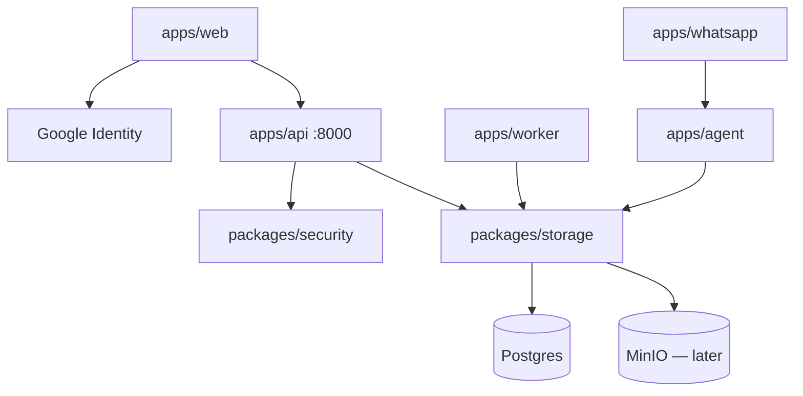

# Architecture

Concise reference for this repo. Locked decisions: [decisions.md](./decisions.md). V1 scope: [../product/scope.md](../product/scope.md).

## Shape

| Layer | Choice |
|---|---|
| Repo | One git repo |
| Frontend | **pnpm** only inside `apps/web` (Vite + shadcn nova) |
| Python | Root **uv** workspace, one `uv.lock` |
| Backend style | **Modular monolith** — one main API + shared packages |
| Database | One **Postgres**, one schema, one Alembic tree under `apps/api` |
| ORM | **SQLModel** in `packages/storage` |

## Layout (real paths)

```
apps/api/src/api/          FastAPI app, routers + auth orchestration
  routers/health.py        GET /health
  routers/auth.py          register, login, google, refresh, logout
  routers/users.py         GET /users/me
  auth.py                  register/login/google/refresh/logout
  schemas/auth.py          register, login, google, token, UserPublic
  main.py                  lifespan: env + Postgres ping; CORS from CORS_ORIGINS

packages/storage/src/storage/
  models/user.py           User, AuthIdentity, RefreshSession
  crud/user.py             identity queries
  settings.py              DATABASE_URL
  database.py              engine, ping

packages/security/src/security/   argon2 hash, access JWT, hashed refresh, CurrentUserDep
  google.py                Google ID token verify (JWKS)

apps/web/                  React + Vite + shadcn (not a uv member)
  src/app/                 entry, App, global CSS, typeset
  src/api/client.ts        axios + interceptors (`VITE_API_URL`, credentials)
  src/api/<resource>/      `<resource>.ts` + `<resource>.types.ts` (health, auth, users)
  src/hooks/<resource>/    TanStack Query (`hooks/auth/use-auth.ts`, `hooks/users/use-me.ts`)
  src/lib/query-client.ts  QueryClient singleton

apps/worker|agent|whatsapp  later separate deployables
```

Auth, spend, documents, and overview are **router modules inside `apps/api`**, not separate HTTP services.

## High-level diagram



## Guide vs this repo

The [BUILD_AND_LEARN](../product/BUILD_AND_LEARN.md) guide uses different folder names. Implement **this repo’s paths**:

| Guide | This repo | Why |
|---|---|---|
| `apps/api/app/auth/models.py` | models in `packages/storage` | worker/agent import storage without HTTP |
| SQLAlchemy models | SQLModel | course pattern + less dual-model noise |
| Root pnpm workspace | uv workspace; pnpm only in `apps/web` | Python is the backend |
| `packages/ui`, `packages/api-client` | deferred | axios + RQ inside `apps/web` |

## Run locally

Dev Postgres is **Neon** (`kosh`). Set `DATABASE_URL` in `.env` to the **direct** host (`postgresql+psycopg://…?sslmode=require`, no `-pooler`). Skip Docker unless you want a local fallback.

```bash
uv sync --all-packages
uv run --directory apps/api alembic upgrade head
uv run --directory apps/api fastapi dev --port 8000
cd apps/web && pnpm dev
```

Optional local Postgres: `docker compose up -d` and the localhost URL in `.env.example`.

`apps/web/.env` sets `VITE_API_URL` (empty = Vite proxy) and `VITE_GOOGLE_CLIENT_ID`. API CORS: `CORS_ORIGINS` (default localhost/127.0.0.1:5173) with credentials. Design tokens: [../design/global.md](../design/global.md).
