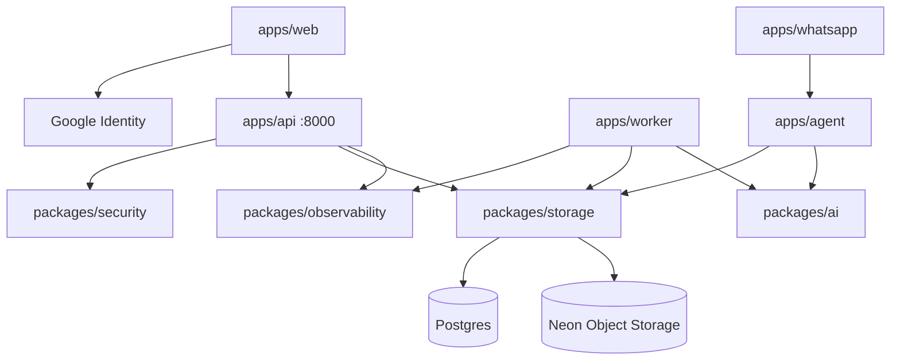

# Architecture

Concise reference for this repo. Locked decisions: [decisions.md](./decisions.md). V1 scope: [../product/scope.md](../product/scope.md).

Paths below are what exists today. Layering inside `apps/api` and `apps/worker` is [backend.md](./backend.md).

## Shape

| Layer | Choice |
|---|---|
| Repo | One git repo |
| Frontend | **pnpm** only inside `apps/web` (Vite + shadcn nova) |
| Python | Root **uv** workspace, one `uv.lock` |
| Backend style | **Modular monolith** — one main API + shared packages |
| Database | One **Postgres**, one schema, one Alembic tree under `apps/api` |
| ORM | **SQLModel** in `packages/storage` |

## Layout (real paths)

```
apps/api/src/api/          FastAPI app factory + feature modules
  main.py                  lifespan: logging, env + Postgres ping; CORS from CORS_ORIGINS
  bootstrap.py             register routers + exception handlers
  common/                  SessionDep, DomainError, handlers, request logging middleware
  modules/health/          GET /health
  modules/auth/            register, login, google, refresh, logout
  modules/users/           GET /users/me; UserPublic
  modules/spend/           SpendItem CRUD + summary + presenter
  modules/documents/       upload, manual create, list, detail, confirm, line items

packages/storage/src/storage/
  models/user.py           User, AuthIdentity, RefreshSession
  models/spend.py          SpendItem
  models/document.py       Document, ExtractionAttempt
  crud/user.py             identity queries
  crud/spend.py            ledger + draft upsert
  crud/document.py         upload metadata, claim_next, reclaim_stuck
  blobs.py                 S3 put/get (Neon Object Storage, path-style)
  settings.py              DATABASE_URL, documents bucket
  database.py              engine, ping

packages/security/src/security/   argon2 hash, access JWT, hashed refresh, CurrentUserDep
  google.py                Google ID token verify (JWKS)

packages/ai/src/ai/        OpenRouter client, normalize, ReceiptExtraction | StatementExtraction

packages/observability/src/observability/   stdlib logging to stdout: text | JSON, redaction, bound ids

apps/worker/               document extraction loop
  src/worker/main.py       reclaim + claim + dispatch
  src/worker/bootstrap.py  logging, settings + Postgres ping
  src/worker/consumers/extraction/  consumer → handler → services; one outcome line per job
  src/worker/common/outcome.py      Ready | Retry | Failed

apps/web/                  React + Vite + shadcn (not a uv member)
  src/app/                 entry, App, global CSS, typeset
  src/api/client.ts        axios + interceptors (`VITE_API_URL`, credentials)
  src/api/<resource>/      `<resource>.ts` + `<resource>.types.ts` (health, auth, users)
  src/hooks/<resource>/    TanStack Query (`hooks/auth/use-auth.ts`, `hooks/users/use-me.ts`)
  src/lib/query-client.ts  QueryClient singleton

apps/worker|agent|whatsapp  worker exists; agent/whatsapp later
```

Auth, spend, documents, and overview are **modules inside `apps/api`**, not separate HTTP services.

## High-level diagram



## Guide vs this repo

The [BUILD_AND_LEARN](../product/BUILD_AND_LEARN.md) guide uses different folder names. Implement **this repo’s paths**:

| Guide | This repo | Why |
|---|---|---|
| `apps/api/app/auth/models.py` | models in `packages/storage` | worker/agent import storage without HTTP |
| SQLAlchemy models | SQLModel | course pattern + less dual-model noise |
| Root pnpm workspace | uv workspace; pnpm only in `apps/web` | Python is the backend |
| `packages/ui`, `packages/api-client` | deferred | axios + RQ inside `apps/web` |

## Run locally

Dev Postgres is **Neon** (`kosh`). Set `DATABASE_URL` in `.env` to the **direct** host (`postgresql+psycopg://…?sslmode=require`, no `-pooler`). Skip Docker unless you want a local fallback.

```bash
uv sync --all-packages
uv run --directory apps/api alembic upgrade head
uv run --directory apps/api fastapi dev --port 8000
uv run --package worker python -m worker.main
cd apps/web && pnpm dev
```

Optional local Postgres: `docker compose up -d` and the localhost URL in `.env.example`.

`apps/web/.env` sets `VITE_API_URL` (empty = Vite proxy) and `VITE_GOOGLE_CLIENT_ID`. API CORS: `CORS_ORIGINS` (default localhost/127.0.0.1:5173) with credentials. Worker needs `OPENROUTER_API_KEY` and Neon S3 `AWS_*` keys; the API starts without them. Both processes read `LOG_LEVEL` (default `INFO`) and `LOG_FORMAT` (`text` locally, `json` wherever logs are shipped). Design tokens: [../design/global.md](../design/global.md).
